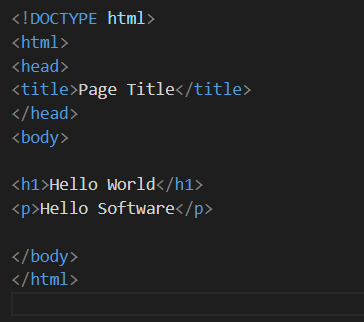

# Kodluyoruz Ilk Repo
Bu repo [Kodluyoruz](https://www.kodluyoruz.org) Front-End Egitiminde oluşturduğumuz ilk repo. İçerisinde hir adet README dosyası, bir adet de index.html barındırıyor.


## IMAGE MY HTML CODE 
[](http://github.com/)


## Installation
Öncelikle projeyi clonelayın. (Buraya sizin reponuzdan aldığınız link gelecek)

```
git clone https://github.com/cengizcsatarani/kodluyoruzilkrepu.git

```
## Usage

Projeyi cloneladıktan sonra Visual Studio Code programında açınız.

Linux için:


```
cd kodluyoruzitkrepo
code

```
## Contributing


Pull requestler kabul edilir. Büyük değişiklikler için, lütfen önce neyi değiştirmek istediğinizi tartışmak için bir konu açınız.

## License

[MIT](https://choosealicense.com/licenses/mit/)